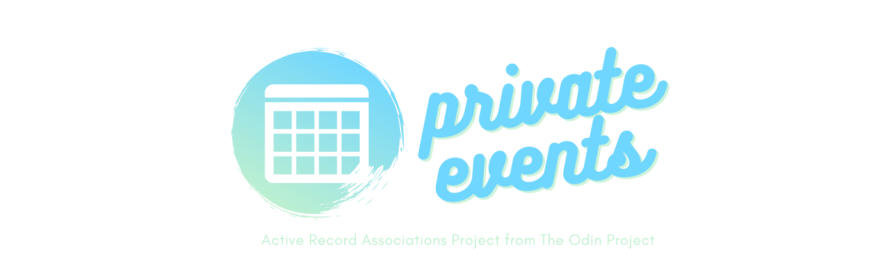
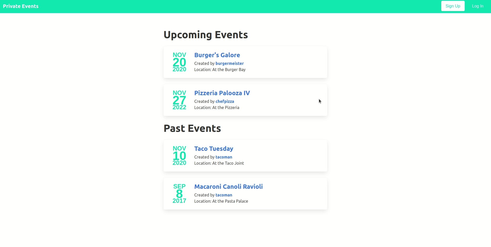

# Project: Private Events 

A project built for [The Odin Project Ruby on Rails Course](https://www.theodinproject.com/courses/ruby-on-rails/lessons/associations) to implement learnings about Active Record Associations. The goal is to create an event manager site, which allows users to create events and invite other users.

## Features 
Users can create and manage events, as well as see events they are attending or have created. On the Index page, events are sorted into two categories, upcoming and past. A user can choose to attend any event, or cancel their attendance. 

Authentication is rudimentary. Users are able to create accounts with just an username, and do not need to provide a password. 

Although design was not a requirement, basic styling was added using the [Bulma](https://bulma.io/) gem, which is a modern CSS framework based on Flexbox, built for Rails.

## Demo 
Check out the live version here: [Link](https://mysterious-hamlet-41700.herokuapp.com/)

You can log in as any of the following
* burgermeister
* tacoman
* muffinman
* chefpizza

## Reflections
The project was challenging, but it was manageable by methodically dividing main features into smaller and simpler problems. For this project, I focused on navigating the MVC and gained incredible insights into the magic of Rails. 

In one situation, I was struggling because I kept coming across an error thrown by failure to pluralize or singularize file names. It was a lesson hard-learned but I'm grateful for it. Now I know what to look out for when creating files using generators besides scaffold. 

I felt most lost when trying to create the many-to-many association between Attendees and Events, however, I resolved it by breaking the concept down into what I already knew (creating join tables), and adding in the concepts learned from the previous lesson materials. 

I had a great time working with Bulma, which made the design minimalistic yet aesthetic. In this project, I finally got a firm understanding of writing views and manipulating content. I'm proud of what I did in this project because it was the toughest project I've done so far.
